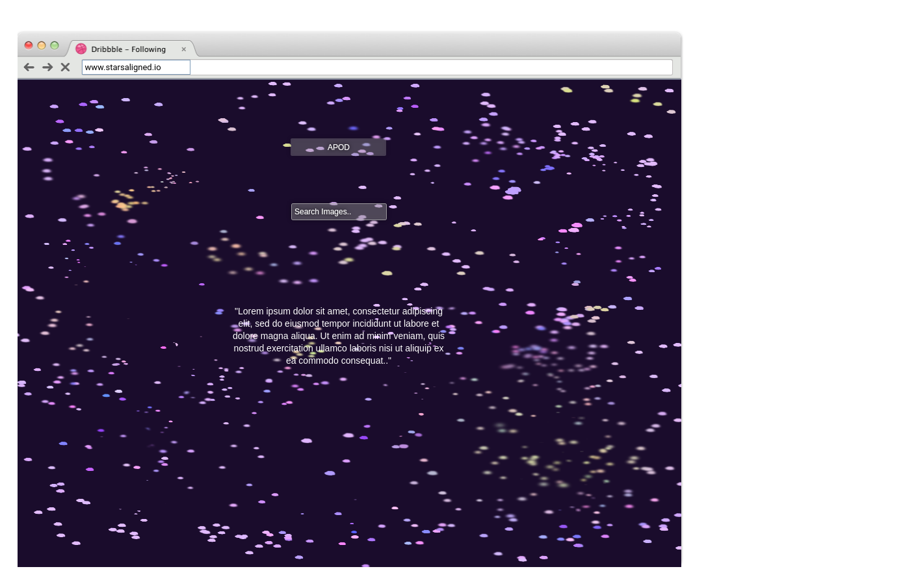
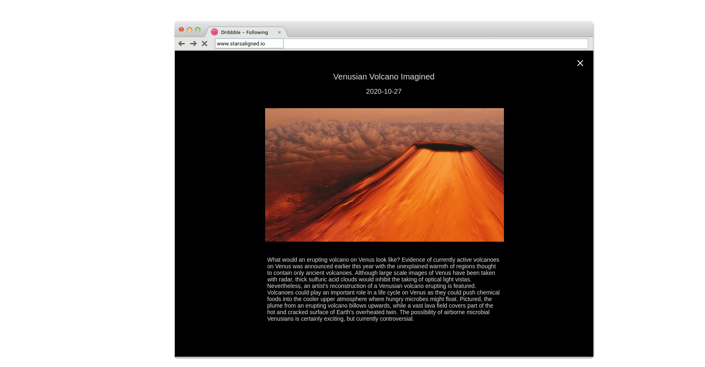
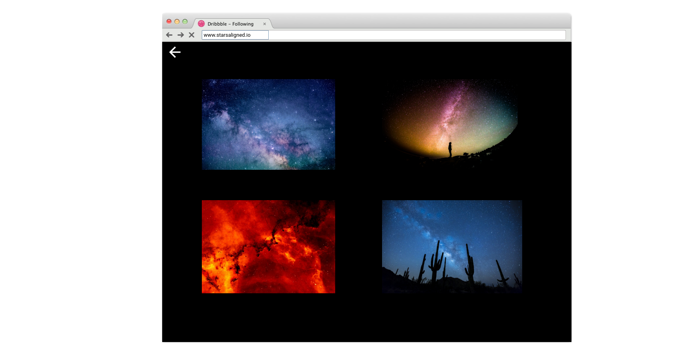
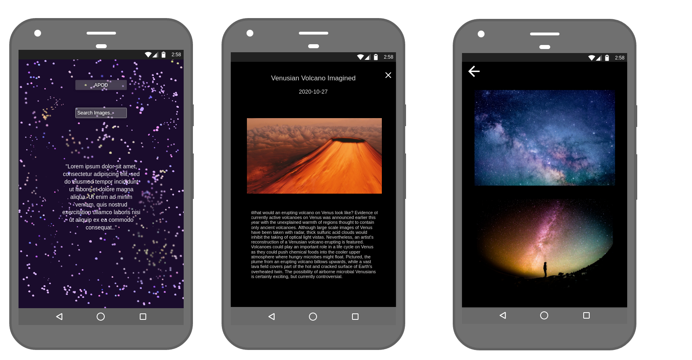

# Stars-Aligned 

https://rootcanopy.github.io/Stars-Aligned/

---

## Project Info
When searching for API's back when we started this project I went through so many and wanted to use them all, but when I seen the NASA page on https://www.openapis.org/ it immediately captured my interest. I've always been interested in the sky at night and how it provokes my curiosity. I was fond of the telescope growing up and collected some navigational books which I still have today(well, my parents still have in Ireland). So it's pretty cool to have built a site which has so many fascinating images and it's also encouraged me to pick-up a past-time again and take some more time out in the dark to admire the beauty that we completely miss.

- Here is the link to the NASA site where the key is recieved.
https://api.nasa.gov/

---

## UX

The website was created for better visualizing of the images gathered from the Nasa APi. I felt with a relatively dark theme it would highlight the awesome glorious colors of the sky above us. I also felt I did need so much going on around the site, kept it simple so to speak to the user could enjoy the images and colors abitmore.

### User Stories

- I was able to see the Nasa's APOD in the mornings before, work?
- I was able to move around easier and wasn't distracted.
- I was able to get some information regarding the images.
- I felt a little more educated about our planet? 

## Features

- A somewhat mesmerising landing page. Get it on a big screen on a Saturday night, you may not return to 'normality'.
- The Astrological image of the day is pretty cool, the explanation is also thought provoking.
In that every few days a video also becomes available.
- I feel the background image is a key feature as it feels for me quite attractive and appealing when arriving on the page after a break away. A little motivator.
- The CSS stars are pretty epic too and Im pretty happy with the way they sit on top of the background image so well. On a big screen it does have a virtual reality feel.
- The Quote on the main page.
- The image library. Theres so many really cool photos in there and some of them do hold historical importance.

### Features Left to Implement

Ideally, in my head I'd like to try and get all of the NASA API's in here, and make it educational. Theres alot of good knowing that comes from these kind of sites. Alot of the API's are in RealTime so it would constantly have new content and something new for some people to see which in time would probably lead to decent traffic if the SEO is a focus. 
    If this was the eventual plan I'd probably swap over to flask and give a shot at managing the entire site and host it on a private server from my kitchen, beside the fridge.
It originally had a live map view of the ISS but I removed it after continuing because it wasnt so important to me as getting the main page or the image gallery right.

In the coming months if I do get to work on this I think I would concentrate more on the javascript end of things and making it truly interactive because the NASA API's really do have alot of great content and manipulating it, making it fun would be awesome.

---

## Technologies Used
- VSCode - LiveServer, Arch Linux and the terminal to setup the project and manage files and folders. 
- My Lg TV was also used for most of the project until I realised the sizing was completely different so I dragged the browser over to the TV monitor every now and then to see how it was looking.
- HTML5, CSS, Bootstrap4 - minimally maybe not at all, JavaScript, FontAwesome
-API: NASA APOD & Image Library
- Pencil was used for the wireframes
- Markdown preview for the Readme

---

## Testing
Website was tested using 5 devices: Laptop with Chromium and Firefox, Tablet (Samsung T700) and smartphones (Samsung s8+ && Samsung s10+) and a large Lg TV. 
The site was also tested using Inspect function in Chromium DevTools.
HTML and CSS Validators were also used midway through and again when I felt I was happy to push into production.

---

### Bugs Found

- APOD button every now and then when clicked the response is a 404, the X-RateLimit is always well above cut-off and having just left it alone for awhile it spontaneously responds without errors.
After doing a search of course I found this thread https://github.com/nasa/apod-api/issues/14 which explains the same issue. As does this list which is as recent as 6 days ago at the time of typing this => https://github.com/nasa/apod-api/issues. My theory is the time change isint as instant as it could be and theres a delay with changing over to new data as the server is hosted in the US, I know this because I ran a domain scan.

- Im not sure if theres a bug in there or if its my own lack of knowing, but I noticed alot of times my styles weren't taking affect. But maybe Im the bug :)

---

## Deployement

Using Git Command Line to upload to a repository

Spring a terminal and log these commands:
git init to initialize a new repository
git add README.md to add README.md file to repository
git commit -m "Initial commit" to add a message for first commitment.
git remote add origin https://github.com/{user}/{your_repository_name}.git to assign repository
git push -u origin master to upload files to the repository

Project is deployed @ GitHub.
Github was used in deployement process as it is integrated, simple and there is no need to use additional services.
It also contained Version Control and everything is uploaded using terminal commands (git)

How was it done ?

Open www.github.com.
Login with your credentials.
On the right of the navbarNav in your account options you would look for the 'settings' link.
Scroll down and look for 'GitHub Pages'.
Under the source section select the 'master branch' option.
A message should appear - 'Your site is ready to be published at https://$YourLogin.github.io/$RepositoryName/
Your website has hopefully been deployed.

And also, to keep gh-pages up-to-date after deployment, because we all know it'll never be finished :

$ git add .
$ git status // to see what changes are going to be commited
$ git commit -m 'Some descriptive commit message'
$ git push origin master

$ git checkout gh-pages // go to the gh-pages branch
$ git rebase master // bring gh-pages up to date with master
$ git push origin gh-pages // commit the changes
$ git checkout master // return to the master branch

---

## Media

- The background image came from unsplash.
- The Galaxy background Im not actually sure where it came from now and unfortunately I haven't been    able to find the exact source. Originally the site was using particles.js but it got a little complicated so then I began using the stars.
- I used this guide (https://dev.to/mugas/create-a-image-gallery-with-css-grid-and-flebox-5lo) to figure out the image gallery, many attempts had been made on my own but it just wasnt working out the way I wanted.
- The images used in the wireframes I grathered from Pixabay
- And the favicon came from flaticon :)

---

## Acknowledgements

I would like to say a big thanks to Neil from CodeInstitute for giving me so many opportunities over the last few months. I cant express my gratitude enough.
Also, Kevin and Xav, while pretty much picking up where I left off months ago with this, I remembered alot of what I had learned from them both and I really enjoyed the experience of having them as mentors.
